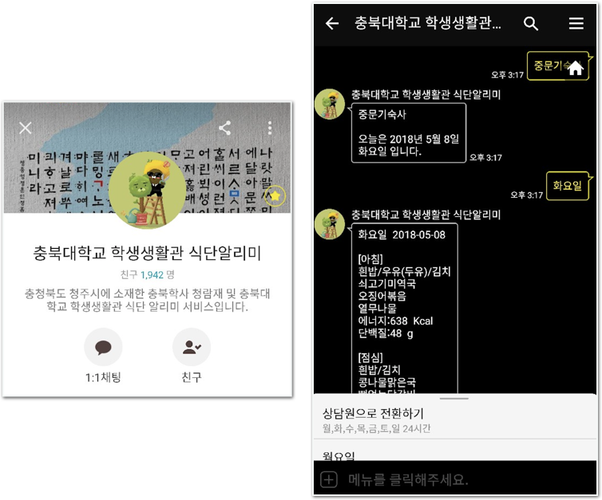

# 충북대학교 학생생활관 식단알리미
충청북도 청주시에 위치한 충북학사 청람재 및 충북대학교 학생생활관 식단 알리미 서비스입니다.

#### 개요

충북대학교의 세 기숙사 - 중문기숙사 / 양성재 / 양진재 - 그리고 충북학사 청람재에서 거주하고 있는 학생들을 위한 식단자동응답기 입니다. Ruby on Rails를 이용해 초기 버전을 구현하였으며 현재는 **Django**를 이용하여 개발하고 운영하고 있습니다.

총 네 군대의 기숙사와 세 군대의 학교식당의 식단을 보기 위해서 3개의 홈페이지와 4번 이상의 클릭이 필요합니다. 흩어져있는 식단 정보를 편리하게 보기위해서 어떠한 방법이 있을까? 하는 고민을 통해 개발하게 되었습니다.

#### 라이브러리

1. Django 1.10 ( django-rest-framework )
2. BeautifulSoup4
3. KakaoTalk Auto Reply API
4. PyOWM - OpenWeatherMap API를 위한 python wrapper 입니다
5. Selenium
6. virtualenv
7. Jupyter notebook

#### 운영 및 개발환경

1. MacOS
2. CentOS7
3. NginX
4. UWSGI
5. Python3

#### 스크린샷

 

서비스를 이용하는 학생들의 피드백을 통해 추가된 기능입니다. 각 기숙사 버튼을 클릭했을때 **오늘 날짜**를 알 수 있으며 식단 출력을 위한 요일 선택에 헷갈리지 않기 위함입니다. 

 

OpenWeatherMap API를 통해 청주시의 날씨 정보를 받아오고 출력합니다. 간단하게 **현재 온도**와 **습도** 그리고 **흐린 정도**를 표시하고 있습니다.

 

학교 홈페이지의 두 가지 공지사항을 출력합니다. 최근 다섯개만을 제공하고 있으며 바로 웹페이지를 통해 볼 수 있도록 링크와 같이 안내하고 있습니다.

# Chungbuk National University dorm's menu alarm bot

This is KakaoTalk auto reply bot to notify domitory's menus for Uni. students in Chungbuk National University.

There are development environment and library used below.

1. CentOS7
2. NginX
3. UWSGI
4. Python3
5. Django 1.10 ( django-rest-framework )
6. BeautifulSoup4
7. KakaoTalk Auto Reply API
8. PyOWM
9. Selenium
10. virtualenv
11. Jupyter notebook